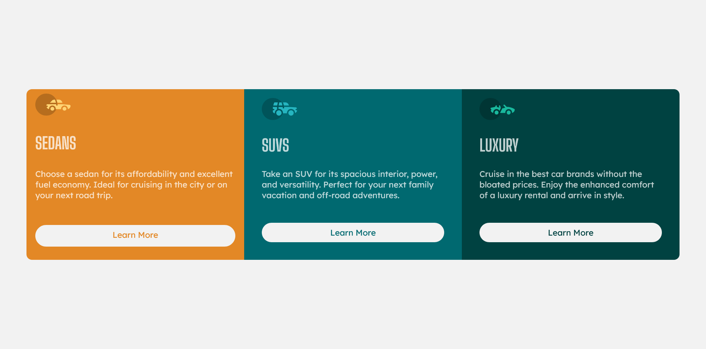

# Frontend Mentor - 3-column preview card component solution

This is a solution to the [3-column preview card component challenge on Frontend Mentor](https://www.frontendmentor.io/challenges/3column-preview-card-component-pH92eAR2-). Frontend Mentor challenges help you improve your coding skills by building realistic projects. 

## Table of contents

- [Overview](#overview)
  - [The challenge](#the-challenge)
  - [Screenshot](#screenshot)
  - [Links](#links)
- [My process](#my-process)
  - [Built with](#built-with)
  - [What I learned](#what-i-learned)
- [Author](#author)


## Overview

### The challenge

Users should be able to:

- View the optimal layout depending on their device's screen size
- See hover states for interactive elements

### Screenshot




### Links


- Live Site URL: [Live site URL here](https://limsael.github.io/three-column-preview-card-component/)

## My process

### Built with

- Semantic HTML5 markup
- CSS custom properties
- CSS Grid
- Sass
- Mobile-first workflow


### What I learned


```css
a {
    color: $bright-orange;
    background-color: $very-light-gray;
    text-decoration: none;
    padding: 0.5rem 0.9rem;
    display: inline-block;
    margin-block: 0.6rem 1rem;
    border-radius: 2rem;
    transition: background-color 0.5s ease-in-out;
    text-align: center;

    &:hover {
      background-color: transparent;
      color: $very-light-gray;
      border: 1px solid $very-light-gray;
    }
}
```


## Author

- Frontend Mentor - [@limsael](https://www.frontendmentor.io/profile/limsael)
- Twitter - [@limsael525](https://www.twitter.com/limsael525)

